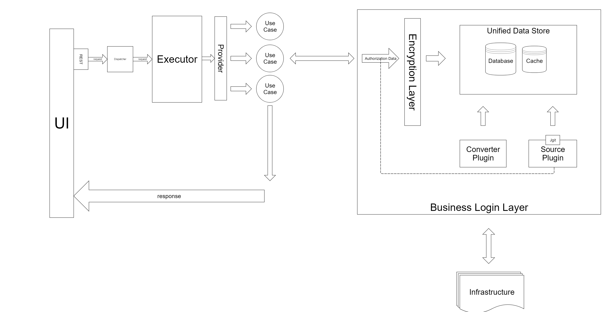

White Box
=========

As pictrued on the diagram above, Git Viewer For Confluence uses architecture based on Clean Architecture.
Each Request that is processed by the Rest layer is forwarded by the Executor layer to the business layer via use cases.

[BACK](../../5.0%20-%20Building%20Block%20View.md)
