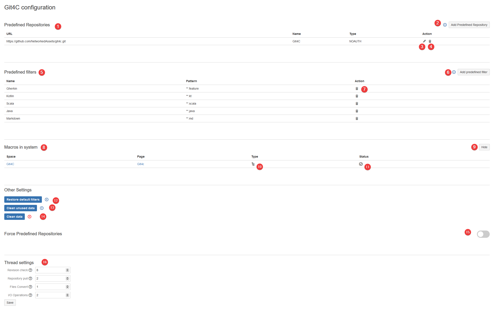
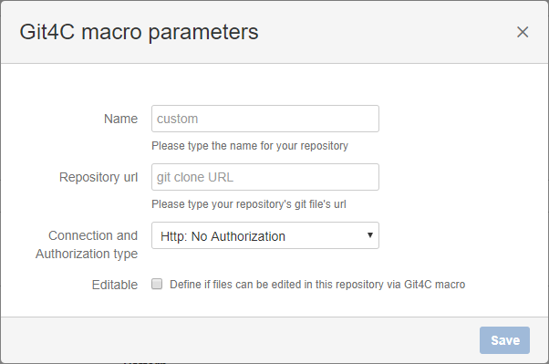
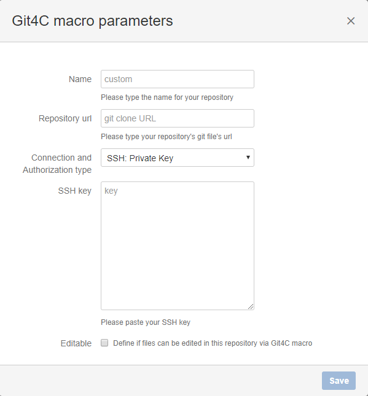
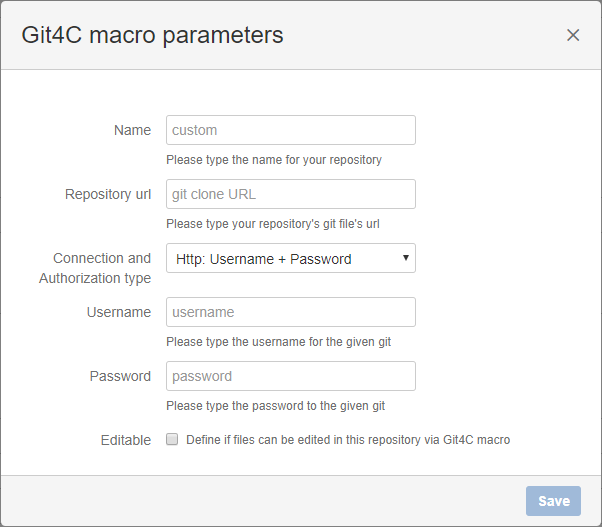
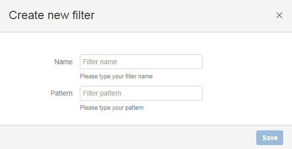
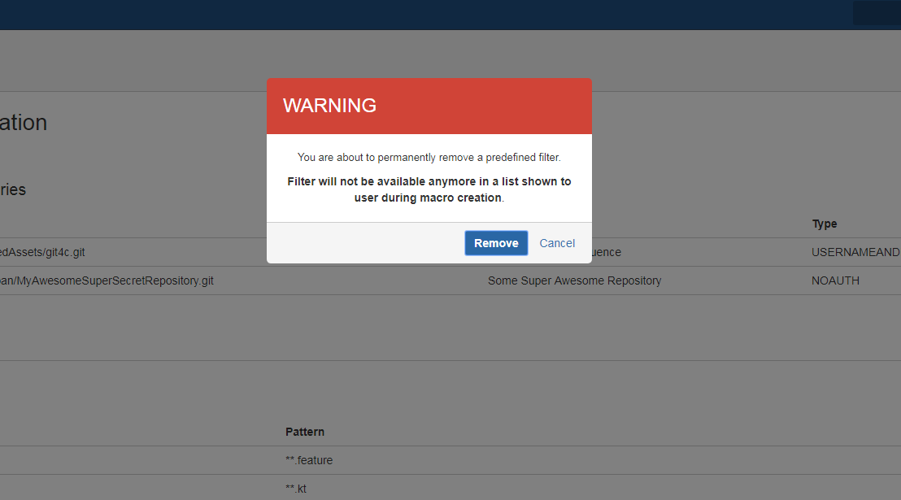
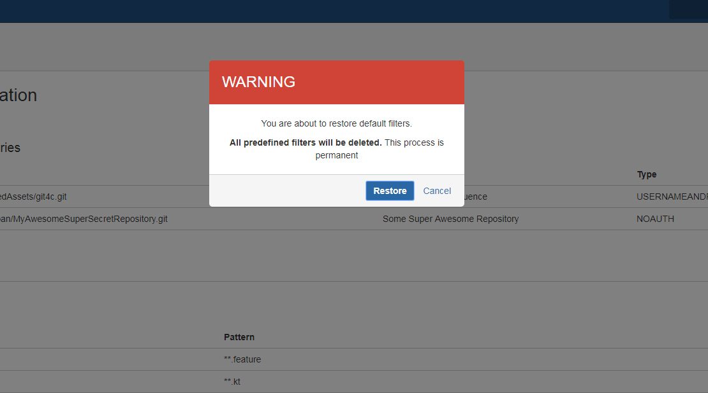
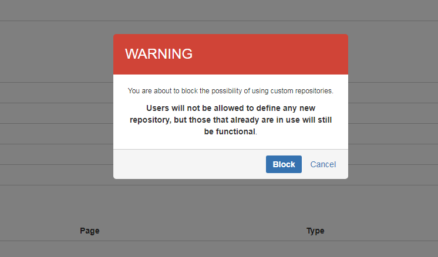

---
---
# Overview

Admin panel is located in General configuration → Administration → Git4C Admin.

1. List of Predefined repositories
2. Button for adding predefined repository
3. Button for editing a given predefined repository
4. Remove given predefined repository button
5. List of predefined filters
6. Button for adding a predefined filter
7. Remove given predefined filter button
8. List of macros in system
9. Multi file macro indication
10. Single file macro indication
11. Macro healthcheck
12. Remove all plugin data
13. Remove all filters and restore default ones
14. Clean all unused data
15. Force users to use predefined repositories only

# Cleaning data
To remove all plugin click "Clean data" on the bottom of the page. To conflirm action click "Clean".

# Creating predefined repository
You can create new predefined repository by clicking "Add Predefined".

After clicking the button a dialog would show up.

You can change authorization type to SSH or HTTP username and password.

# Removing predefined repository
You can remove predefined repository by clicking bin icon on the right-hand site. To confirm deletion click "Remove" button in dialog that would show up.

# Creating new filter
You can create new predefined repository by clicking "Add predefined filter".

Git4C uses Glob for filtering files. https://docs.oracle.com/javase/tutorial/essential/io/fileOps.html#glob 

# Removing filter
You can remove filter by clicking bin icon on the right-hand site. To confirm deletion click "Remove" button in dialog that would show up.

# Restoring filter
To restore default filters click "Restore default filters" at the bottom of the page. To confirm click "Restore" button in dialog that would show up.

# Forcing predefined repositories

Git4C offers a possibility to allow users creating macro only with predefined repositories.

To block custom repositories simply switch the toggle button on.

<b> Remember, this will only block creating a new macro with custom repository. Those already craeted will still be functional and editable.<b/>

To confirm this action click the <b>Block</b> button on warning dialog.

