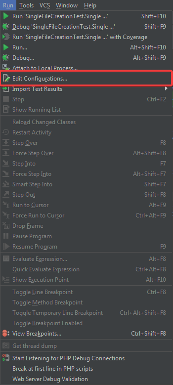
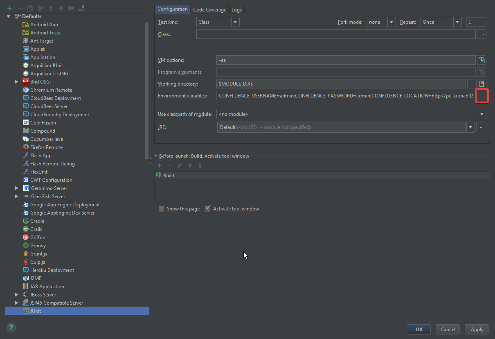
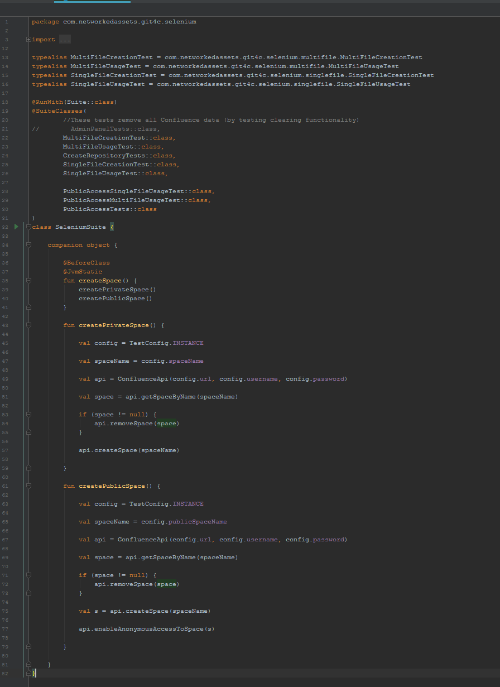
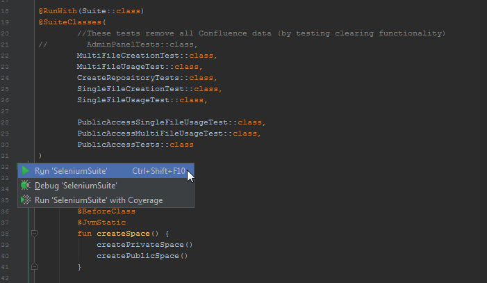

# Testing

### Setup

- Install Chrome browser and Firefox
- Download [Chrome driver](https://sites.google.com/a/chromium.org/chromedriver/downloads) and extract it to `C:\Selenium\chromedriver.exe`
- Download [Gecko driver](https://github.com/mozilla/geckodriver/releases) and extract it to `C:\Selenium\geckodriver.exe`

### Local testing setup
- IntelliJ IDEA instances with Git4C source directory
- `atlas-run` in "confluence-plugin" directory

## Environmental variables

Configuring your environmental variables can be done directly in IntelliJ IDEA.
Configuration panel can be found in `Run > Edit Configurations`

Configurations dialog should appear. Find `default JUnit configuration` and open Environmental Variables configuration dialog

There will be 4 necessary variables to define

- FIREFOX_LOCATION: ip:port of firefox instance or location of gecko driver
- CONFLUENCE_LOCATION: url of Confluence location to test
- CONFLUENCE_USERNAME: username of the confluence user we want to test as
- CONFLUENCE_PASSWORD: password of the confluence user we want to  test as

## Confluence settings
- Confluence must have anonymous access enabled

## Running tests

### Running all safe tests

To run all data-safe tests find SeleniumSuite class in Selenium package.

Previously configured environment will allow you to run all crucial UI test from there

To do that, click on the run arrow near the class name, different options will appear.

Run or debug the Selenium Suite by clicking one of the options.

This test will proceed with automatic confluence setup, space creation and will provide all of the nescessery for testing requirements for you.

Tests that will be run are described in @SuiteClasses annotation.

Tests that are not safe on some instances like Admin panel tests that could potentially damage database of your confluence and will remove all of your macros are not included in the selenium suite.

### Running specific test

To run Admin panel tests and any other specific test suite, find the class or single test that you want to run and proceed the same as it's explained with `selenium suite`.

## Test rules
Each test will be done on the Selenium test space in confluence and get separate page that will be removed after test execution.

Every test will be retried 3 times given a failure occured, due to inconsistency of selenium tests and limited memory on test instances.
After each try the screenshoot will be taken at failure and saved to `seleniumtests\target\surefire-reports\`.