---
---
# User Guide: Git Viewer For Confluence

## Adding macro

Create a new page or edit an existing one, then select **"insert more content"** button and choose **"Other macros"** option.


Choose Git Viewer For Confluence macro from the list of available macros in your Confluence.

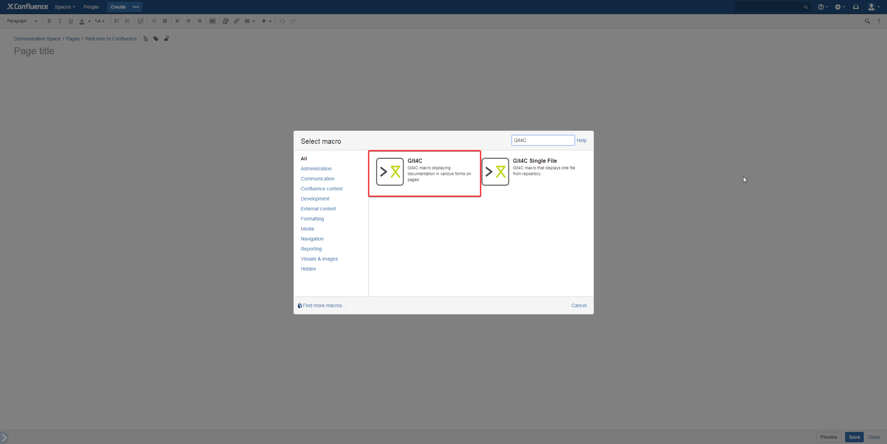

Macro configuration dialog should appear.

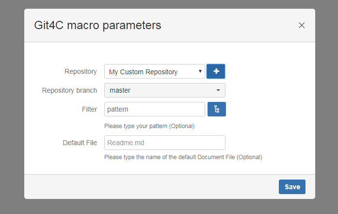

### Repository Configuration
Git4C supports two types of repositories.

#### Predefined Repository

Predefined Repository is a repository defined by the Administrator and made available for all users. Those repositories will be available until Administrator removes them from Confluence. 
You can choose a Predefined Repository from the list of repositories in the macro configuration dialog. 

#### Recently used

Git4C stores information about 5 recently used repositories for your convenience.
Those repositories are listed in the repository section.
You can choose this repository and quickly create Git4C macro.

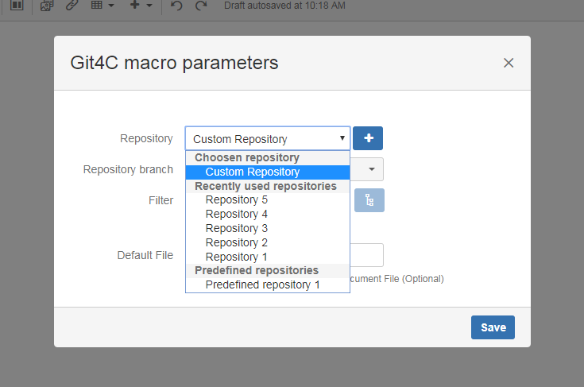


#### Custom Repository

If you wish to include a repository that has not been defined in the Predefined Repositories list, simply click on the **Custom Repository Button** next to the **Predefined Repositories list**.

This option may be blocked by the administrator. In that case, the custom repository button will be disabled.

**Custom Repository Dialog** should appear.

Git Viewer For Confluence macro configuration dialog will ask you to pass necessary parameters of your repository.

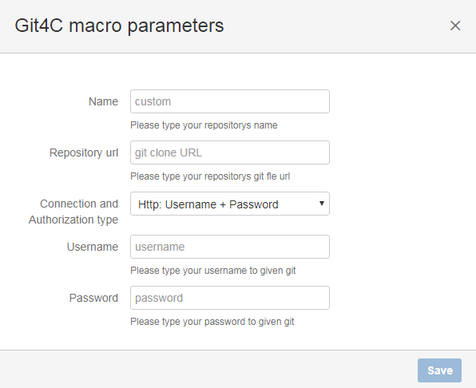  

There are three possible authentication options:

- No authentication for public repositories.
- Username and password authentication for http(s) connection.
- SSH key authentication for ssh connection.

You can choose them in the "Connection and authentication type" dropdown.

Requried fields for Authentication Types:

| Authentication Type        | Required Fields           |
| ------------- |:-------------:|
| HTTP: No Authorization      | Repository Name<br />Repository URL |
| HTTP: Username + Password   | Repository Name<br />Repository URL<br />Username<br />Password      |
| SSH: Private Key | Repository Name <br />Repository URL<br />SSH Key|

After you fill out all the required fields click the **Save** button. Git Viewer For Confluence will verify your parameters and close the **Custom Repository Dialog**.

### Macro Parameters Configuration

After you successfully choose desired repostiory, branch list will be downloaded automatically. <br />
Select default branch to be displayed in Git Viewer For Confluence Macro.

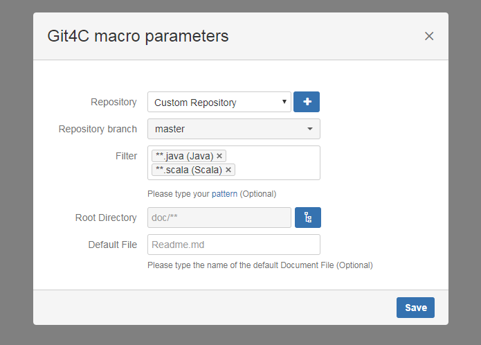

The last remaining fields are Filter Pattern field and Default File field. Those fields are optional. <br />
First one specifies a filter for your files, you can choose any pattern that satisfies your needs, and display only those files in Git Viewer For Confluence Macro you want. <br />
Filter Patterns can be specified by the Administrator, and will be displayed after you click on Filter Pattern input field. <br />
You can also input your own pattern. For more information about how to define Glob Patterns Check: https://docs.oracle.com/javase/tutorial/essential/io/fileOps.html#glob

Git4C offers you the posibility to select the root folder. Simply click on the root folder selection and the tree of files will appear.

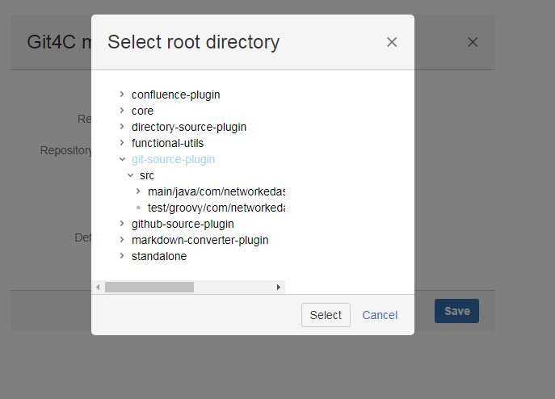

Then select desired root folder and apply it by clicking "Select". Path will be automatically generated and visible in the root directory field.

"Default File" field specifies a path to the file, that will be displayed everytime you visit the page, i.e. `main/java/com/company/product/Main.java`

After you're done, the **Save** button should be enabled, click it to save the macro. Save your page and enjoy Git4C. 

## Using Git Viewer For Confluence

After you have successfully configured and added Git4C macro, you should notice it on your page after it has loaded.

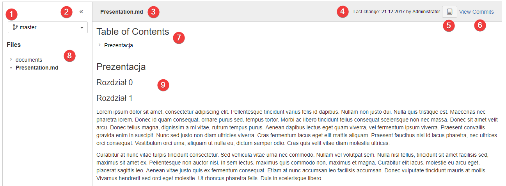

Git4C consists of following elements:
1. Branch selection
2. Hiding sidebar and activating sticky toolbar
3. File name
4. Other file information
5. File source
6. File commits
7. Table on contents
8. Files tree
9. File content

Use the files tree to quickly navigate through the documents. Click on the file presented in the tree to display its content.
Git4C also supports history navigation, so pressing a browser navigation buttons will cause the files to change.

The branch selection dropdown allows you to switch between different branches of your repository in view time. Simply click on the dropdown.


and select desired branch. You should notice the loading screen for a moment. After it's done you have successfully changed your branch.


In the main content view, you'll see few information about the file. It's path and last changes date and their author.

Git4C will automatically generate table of contents for your document and display it in collapsed form.


Click on it to expand it so you can easily navigate through the document.


### Sticky toolbar

Sticky toolbar is new functionality added in 1.2 that allows users to choose files in tree while reading long files.


## Git Viewer For Confluence Single File

### Adding macro

Create a new page or edit an existing one, then select **"insert more content"** button and choose **"Other macros"** option.


Choose Git Viewer For Confluence macro from the list of available macros in your Confluence.

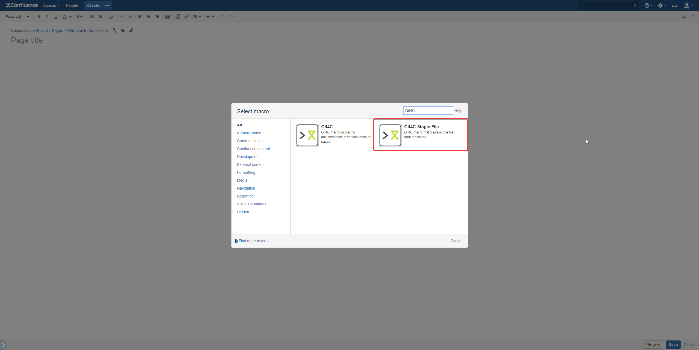

Macro configuration dialog should appear. 

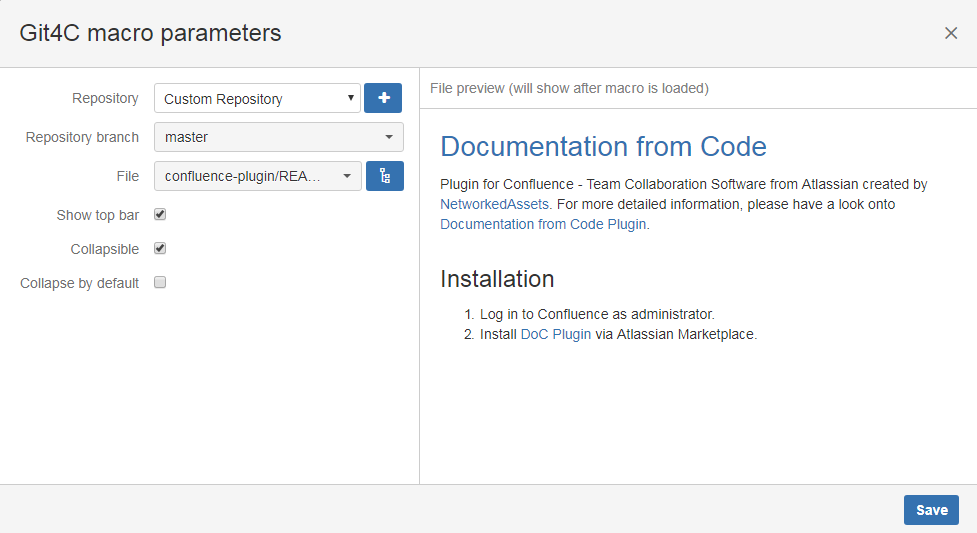

#### Repository Configuration

Repository configuration is the same as in Git Viewer For Confluence Macro.

#### Macro Parameters Configuration

After you successfully choose desired repository, branch list will be downloaded automatically.  

Now you must select file. To do this click the **File Tree Display Button** to see the file tree. Choose the file you need from the tree and click **Save**.

File preview will be displayed on the right side of macro configuration dialog.

Last thing to do is to specify the options for displaying macro.

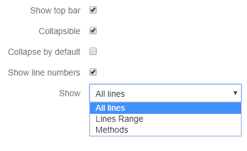

- **Methods in file** this field allows you to choose one method that should be displayed in the macro view, you can also select "All" option to display the whole file.
- **Table of Contents** this fields determines if table of contents will be shown in macro
- **Show top bar by default** specifies if the bar with file information should be expanded or collapsed by default
- **Collapsible** lets you decide if user can collapse the Git4C Single File View. You can also check the **Collapse by default** option to  make Git4C Single File view collapsed every time user opens the page.
- **Collapse by default** specifies if macro will be collapsed after entering page
- **Show line numbers** option decides if enumeration of lines is visible.
- **Show** lets you decide if you want to show whole file, selected method (for code) or selected line range

### Using macro

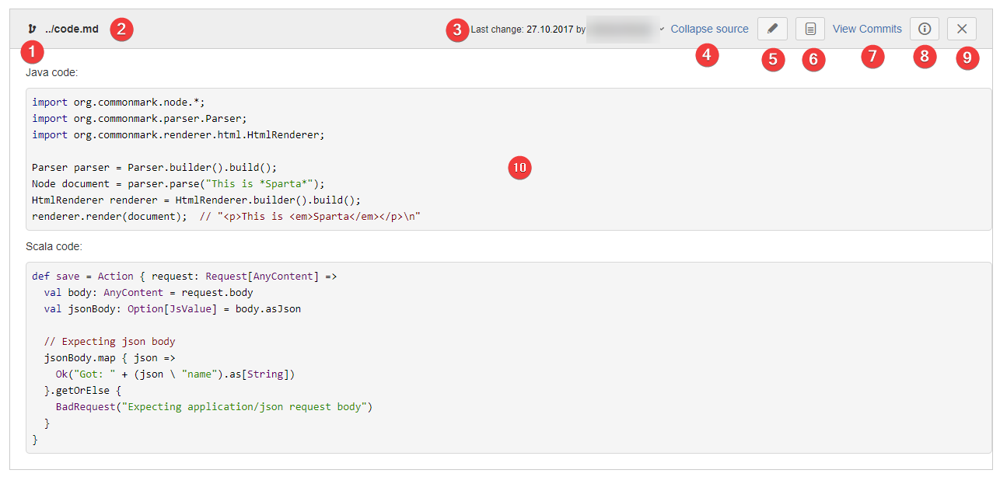

Macro consists of following elements:
1. Branch info
2. File name
3. Information about last change
4. Button to collapse macro
5. Button to edit file (if it's enabled for repository by administrator)
6. Button to show file source (only for .md, .svg and .puml)
7. Button to show file commits
8. Button to show information about macro
9. Button to toggle toolbar
10. File content

When file with code is shown macro contains following elements:


1. Branch info
2. File name
3. Information about last change
4. Button to hide line numbers
5. Button to collapse macro
6. Button to edit file (if it's enabled for repository by administrator)
7. Button to show file commits
8. Button to show information about macro
9. Button to toggle toolbar
10. File content

## PUML support

To add puml to markdown you have to add tag for image, but include puml path in it. <br />

For example this Markdown file:
```

```

With this [file](puml.puml) in the same directory will generate:

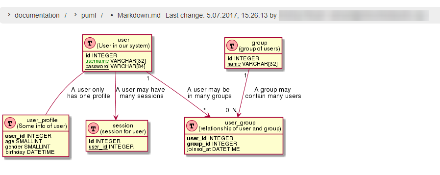

## File editor

In version 1.5 administrator can set predefined repositories to be "editable". When its enabled every single file macro for given predefined repository will have "edit" button in toolbar. After clicking on it editor will be shown

For Markdown:

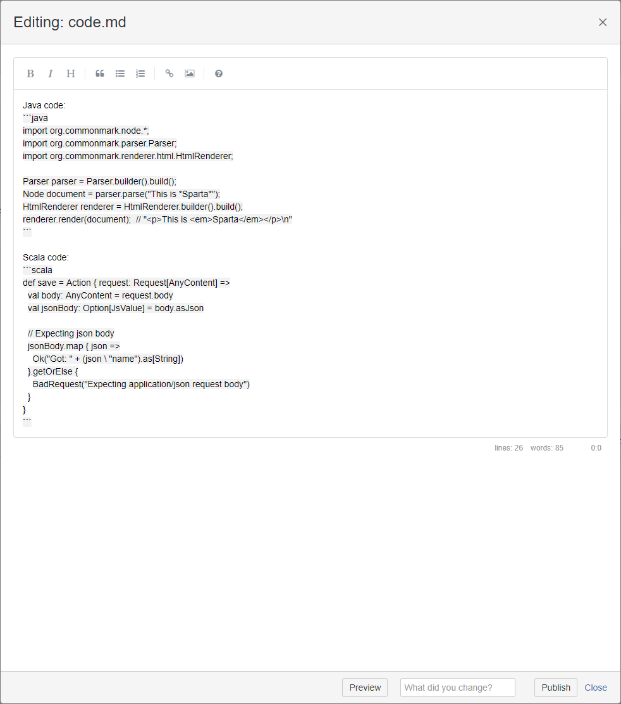

For Code:

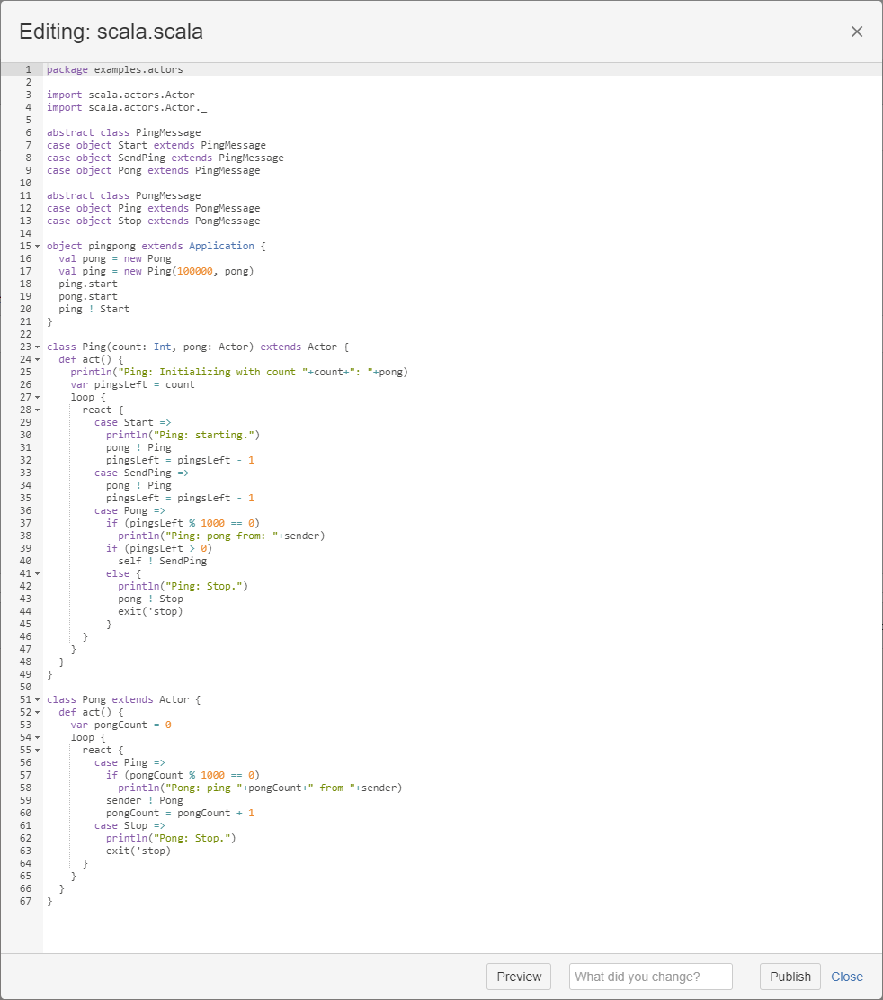


After making your edits input description of your changes and press "Publish button". The file will be uploaded to remote repository. There can be 3 results:

1. File is uploaded successfully. Green notification is shown and page is restarted.

    

2. File cannot be uploaded on branch, but can be uploaded on another branch (i.e file is being uploaded to protected master branch). In that case temporary branch is created, green notification is shown and page is refreshed. After refreshing macro will be showing file from modified branch.
3. File cannot be uploaded on any branch (read-only repository). In that case error with temporary branch and repository location on disc in shown. Contact your administrator to retrieve your change.

    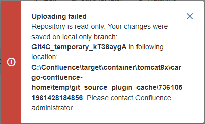